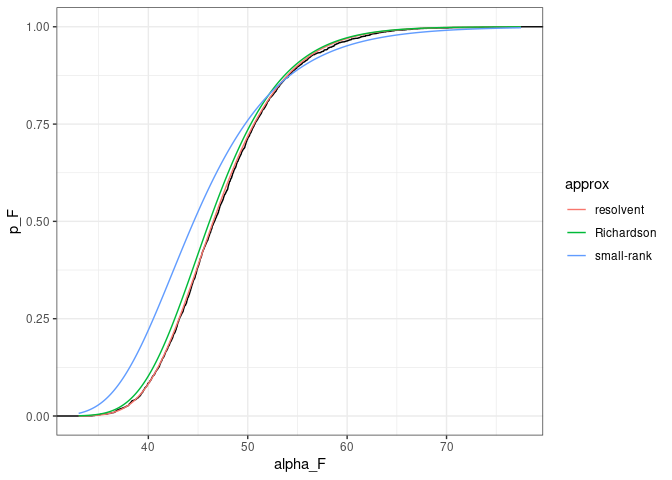

## Overview of the code

The folder `code` contains the code to generate random matrices, compute
*α*<sub>*F*</sub> and calculate the transitions to and from feasibility
(for small matrices).

The folder `Mathematica_Richardson` contains `Mathematica` notebooks that verify the correctness of the equations in Sec B1 of the Supplementary Information.

### Required libraries

``` r
library(sn) # skewed normal distribution
library(mvtnorm) # multinormal distribution
library(tidyverse) # plotting and data wrangling
library(rARPACK) # eigenvalues/vectors of large matrices
library(pracma) # Lambert function
```

### Building random matrices

The file `build_matrices.R` contains the code to build random matrices.
To build a matrix, call `build_matrix(n, dist, rho, sk)` with the
following parameters:

-   `n` size of the matrix
-   `dist` either `discrete`, `beta` or `normal`
-   `rho` correlation between off-diagonal elements
-   `sk` a distribution-dependent parameter controlling skewness

In particular, for `discrete` and `beta`, a parameter `sk == 1` produces
a distribution that is centered around its mean, `sk > 1` a right-skewed
distribution, and `sk < 1` a left-skewed distribution; for these
distributions, only values of `rho` in `1, -1, 0` are implemented.

For the `normal` distribution, `sk = 0` returns the standard normal
distribution, and can accept any `rho`; a positive `sk` makes the
distribution right-skewed, and a negative `sk` a left-skewed
distribution. If `sk` is nonzero, only values of `rho` in `1, -1, 0` are
implemented.

All distributions sample coefficients with mean zero and unit variance.
Addind a positive constant to the matrices does not impact feasibility.

``` r
# example 
source("code/build_matrices.R")
set.seed(1)
# example with discrete distribution
B <- build_matrix(1500, "discrete", 0, 1.25)
# exclude diagonal elements to compute stats
Bp <- B
diag(Bp) <- NA
Bp <- as.vector(Bp)
print(mean(Bp, na.rm = TRUE))
```

    ## [1] 0.0006059151

``` r
print(var(Bp, na.rm = TRUE))
```

    ## [1] 1.000273

``` r
# example with beta distribution
B <- build_matrix(1500, "beta", -1, 1.25)
# exclude diagonal elements to compute stats
Bp <- B
diag(Bp) <- NA
Bp <- as.vector(Bp)
print(mean(Bp, na.rm = TRUE))
```

    ## [1] 8.903139e-22

``` r
print(var(Bp, na.rm = TRUE))
```

    ## [1] 1.000087

``` r
# example with normal distribution
B <- build_matrix(1500, "normal", 0.25, 0)
# exclude diagonal elements to compute stats
Bp <- B
diag(Bp) <- NA
Bp <- as.vector(Bp)
print(mean(Bp, na.rm = TRUE))
```

    ## [1] 0.001371625

``` r
print(var(Bp, na.rm = TRUE))
```

    ## [1] 0.9995525

## Computing *α*<sub>*F*</sub>

For a given matrix *B*, one can compute the value *α*<sub>*F*</sub> that
would make the equation

(*α*<sub>*F*</sub>*I*+*B*)*x* = 1
have a positive solution. We provide two options:
`get_alpha_F(B, n, rho)` can be used for small matrices *B*, and
computes an exact solution by computing the eigenvalues of *n* + 1
matrices; `get_alpha_F_large_random_matrix(B, n, rho)` uses an
alternative search algorithm that is better suited for larger matrices.

``` r
source("code/find_alpha_F.R")
set.seed(1)
# example
B <- build_matrix(25, "normal", 1, 2)
get_alpha_F(B, 25, 1)
```

    ## [1] 14.88475

``` r
get_alpha_F_large_random_matrix(B, 25, 1)
```

    ## [1] 14.88475

### Running simulations

To compute *α*<sub>*F*</sub> for several random matrices, use
`run_simulation`

``` r
set.seed(1)
nsim <- 2500
source("code/build_matrices.R")
source("code/find_alpha_F.R")
source("code/run_simulation.R")
run_simulation(n = 250, dist = "discrete", rho = 1, sk = 1, nsim = nsim)
run_simulation(n = 250, dist = "normal", rho = 0, sk = 0, nsim = nsim)
run_simulation(n = 250, dist = "beta", rho = -1, sk = 1, nsim = nsim)
```

### Computing *p*<sub>*F*</sub>

For each of the three approximations presented in the manuscript (based
on small-rank perturbations, using resolvents, using the Richardson’s
iteration) a file `approximation_small_rank.R` (or `_richardson.R`, or
`_resolvent.R`) contains the function
`pf_approximations(alpha_values, n, rho, dist, sk)`, which returns the
approximate probability of feasibility for the values `alpha_values`
(which can be a vector). An example of how to compute these
probabilities is contained in `plot_approximations.R`, which computes
all three approximations for a simulation of the type specified above.

``` r
source("code/plot_approximations.R")
plot_approximations("results/n_250_rho_0_dist_normal_sk_0.csv")
```


# robust_coexistence_ncomms_2025
